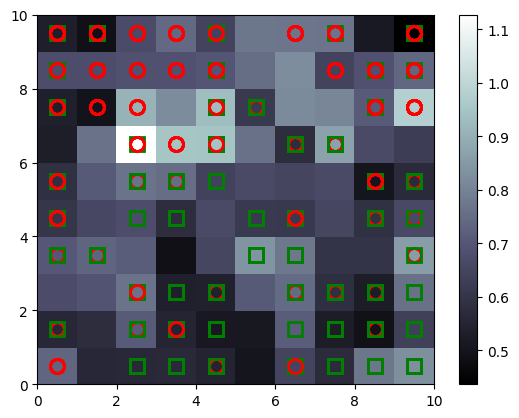

# Scratch-Based SOM for Credit Card Fraud Detection

This project involves implementing a Self-Organizing Map (SOM) from scratch and applying it to detect credit card fraud. The project demonstrates how a SOM can cluster data and identify fraudulent activities using an unsupervised learning approach.

---

## Project Files

1. **`Credit_Card_Applications.csv`**:
   - The dataset containing information about credit card applications, including potential fraud cases.

2. **`som_on_Credit_Card_Fraud_Detection.ipynb`**:
   - A Jupyter Notebook demonstrating the application of the SOM to the credit card dataset.

3. **`som_scratch.py`**:
   - Contains the implementation of the `SOM` class, which defines the core functionality of the Self-Organizing Map.

4. **`test_som_code.py`**:
   - Includes the `TestSOM` class for testing the methods and functionality of the `SOM` class.

---

## Libraries Used

- **For Scratch Implementation**:
  - `NumPy`
  - `pylab`
- **For Application**:
  - `pandas`

---

## How to Run the Project

1. **Clone the Repository**:
   ```bash
   git clone https://github.com/arda92a/SOM-Scratch-Based-Implementation  
   cd SOM-Scratch-Based-Implementation
   ```

2. **Install Dependencies**:
   Ensure you have Python installed, then install the required libraries:
   ```bash
   pip install numpy pandas 
   ```

3. **Run the Notebook**:
   Launch the Jupyter Notebook to see the application in action:
   ```bash
   jupyter notebook som_on_Credit_Card_Fraud_Detection.ipynb
   ```

4. **Test the Code**:
   To test the implementation of the SOM class, run the test script:
   ```bash
   python test_som_code.py
   ```

---

## Example Output

### Winner Map Visualization
The winner map generated by the SOM highlights fraudulent activities. Fraudulent entries appear as **white nodes**, indicating anomalies in the data.

#### Example Map:


In the map, clusters represent different data segments, and fraud cases stand out due to their distinct characteristics.

---

## Key Features

- **Scratch Implementation**:
  - A complete SOM built from scratch in Python (`som_scratch.py`), demonstrating core concepts of unsupervised learning.

- **Fraud Detection**:
  - Identifies fraudulent credit card applications based on clustering anomalies.

- **Testing Suite**:
  - `test_som_code.py` ensures that the methods in the `SOM` class are functioning correctly.

---

## Future Improvements

- **Parameter Tuning**:
  - Automate the selection of SOM parameters (e.g., grid size, learning rate).

- **Dataset Expansion**:
  - Apply the model to larger and more diverse datasets for improved robustness.

- **Enhanced Visualization**:
  - Add interactive visualizations for better interpretability.

---

## Contributions

Feel free to contribute to this project by submitting pull requests or reporting issues. Suggestions for improvement are always welcome!

---

## Contact

For any questions or feedback, please reach out to the project maintainer at [your_email@example.com].

